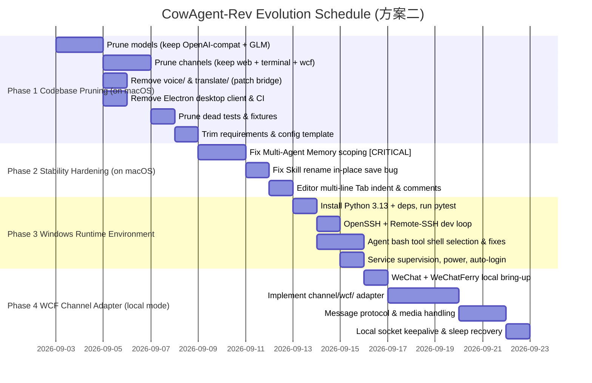

# CowAgent-Rev Technical Roadmap (ROADMAP)

This document establishes the technical roadmap for **CowAgent-Rev**. Scope:
1. **Architecture Pruning & Codebase Cleanup**: Retaining only **Aggregate APIs (OpenAI-compatible protocol)** and the **Zhipu AI (GLM) native SDK**, with communication consolidated to the local `terminal` debug channel and the `web` console (WCF channel and WeChatFerry vendored code removed and archived in `backup/`).
2. **Code Review Bug Fixes**: Eliminating data corruption risks in multi-agent memory scoping and console document editors.
3. **Single-Host Windows Deployment**: Running the **entire CowAgent-Rev stack on the Windows host**, with **macOS used only as a remote development / debugging workstation** over the LAN.
4. **Self-Hosted Only**: A private, single-operator deployment. The Electron desktop client and its release pipeline are removed — the only UI is the `web` console.

> **Repo layout note.** Application code lives directly at the repository root — `app.py`, `config.py`, and the `agent/ bridge/ channel/ cli/ common/ models/ plugins/ tests/ test/ skills/ docs/` trees. Launch: `.\.venv\Scripts\python app.py`, or double-click `test/run.cmd`. WCF patches and docs are archived under `backup/wcf/`.

> **MVP scope note:** This is a personal single-operator setup — in practice one WeChat account and one GLM API key (`config.json`). The codebase keeps its existing multi-model / multi-agent capability; there is simply **no dedicated work to run several models or several WeChat accounts in parallel** (the former "Phase 5 scaling" is dropped). No code paths are removed for this — it is a scope boundary, not a teardown.

> **Deployment model decision (方案二) — re-confirmed 2026-09-04 on corrected facts.** **Development happens on macOS against a simulated WCF server (Milestone 1.7); Windows is the runtime only, launched by double-clicking `test/run.cmd`.**
>
> The earlier version of this note justified the choice by claiming mainline `wcferry` "is not built for cross-host use" and would need a custom thin remote client. **That was wrong.** `Wcf(host=..., port=...)` is a supported remote mode — `_local_mode` is set only when `host is None`, and the Windows-only `sdk.dll` load happens only in local mode — and `wcf.exe` binds `tcp://0.0.0.0` (`WeChatFerry/spy/rpc_server.h:42`), so it genuinely listens on every interface. Running CowAgent-Rev on macOS against a LAN Windows WCF was therefore always possible.
>
> We still run everything on Windows, for two reasons that do hold:
> 1. **The WCF RPC has no authentication.** Exposing `10086`/`10087` on the LAN lets anyone on the segment drive the WeChat account — send messages, read contacts, run `query_sql` against its database. That is what Quality Gate 4 protects. An `ssh -L` tunnel for both ports would restore safety, but reintroduces a persistent tunnel plus reconnect logic — giving back the very simplicity the split was meant to buy.
> 2. **Windows must be running regardless**, since the WeChat client and `spy.dll` injection only exist there. Splitting the runtime does not reduce the number of always-on machines; it raises it from one to two, and either machine sleeping breaks the bot.
>
> **Accepted cost:** the agent `bash` tool must be wired to Git-Bash or WSL, with Windows quirks (`SIGTERM`, `ProactorEventLoop`, path separators, UTF-8) — Milestone 3.3. A macOS runtime would have made that mostly disappear; it is the one real advantage given up, and it is outweighed by the two points above.

---

## Architectural Vision & Topology

```
[ macOS Development Workstation ]
  ├─ VS Code / Cursor — Remote-SSH into the Windows host
  └─ Browser — CowAgent-Rev web console via LAN http://<WIN_LAN_IP>:9899 (or SSH -L forward)
         │
         │ SSH (port 22) for dev; HTTP (9899) for the console
         ▼
[ Local Network (Router / Switch) ]
         ▲
         │
         ▼
[ Windows Host PC — the single runtime host ]
  ├─ Windows Native WeChat Client (logged in officially, CN direct network)
  ├─ WeChatFerry (spy.dll injected into WeChat.exe) — LOCAL mode
  │    ├─ 127.0.0.1:10086 (Command Channel)
  │    └─ 127.0.0.1:10087 (Event Notification Channel)
  ├─ CowAgent-Rev Core (OpenAI-compatible aggregator + Zhipu GLM SDK)
  ├─ Multi-Agent Engine (Memory, Planning, Tools, MCP, Skills)
  │    └─ Agent bash tool runs against Git-Bash / WSL / PowerShell (see Milestone 3.3)
  ├─ OpenSSH Server (inbound TCP 22) — for macOS Remote-SSH
  ├─ Runtime supervised by NSSM / Task Scheduler; power plan = never sleep; auto-login
  └─ Inbound Firewall: TCP 22 (SSH) and 9899 (web console) allowed on the LAN
```

WeChatFerry's `10086` / `10087` sockets stay bound to `127.0.0.1` and are **not** exposed on the LAN.

---

## Development Environment Notes

### macOS → Windows remote development

- **Windows:** enable *OpenSSH Server* (Settings → Optional Features), start the `sshd` service, allow inbound TCP 22 on the private profile.
- **macOS:** connect with VS Code / Cursor **Remote-SSH** (or JetBrains Gateway). Editing, the integrated terminal, `pytest`, and `debugpy` remote-attach all execute on the Windows filesystem — no file sync to manage.
- **Web console:** open `http://<WIN_LAN_IP>:9899` directly on the LAN, or forward it: `ssh -L 9899:127.0.0.1:9899 user@<WIN_LAN_IP>`.

### macOS Clash TUN bypass (only if reaching the console by LAN IP)

When macOS runs **Clash in TUN mode**, system routing sends all outbound IP traffic into the `utun` interface, so a request to `http://192.168.x.x:9899` can be captured and forwarded to a remote proxy node. Add a direct LAN bypass in Clash (not needed if you use `ssh -L`):

```yaml
rules:
  - IP-CIDR,192.168.0.0/16,DIRECT,no-resolve
  - IP-CIDR,10.0.0.0/8,DIRECT,no-resolve
  - GEOIP,LAN,DIRECT,no-resolve
  - MATCH,PROXY
```

---

## Execution Strategy

**Phase 1–2 run on macOS** (pure code work, OS-agnostic) so the codebase is already lean and the CRITICAL memory bug is already fixed **before** anything is stood up on Windows. **Phase 3–4 run on the Windows host.** There is no scaling phase — running several models or several accounts in parallel is out of scope.



---

## Detailed Milestones & Action Items

### Milestone 1: System Pruning & Redundancy Cleanup (Phase 1 — on macOS)
> Goal: Eliminate all unused vendor SDKs and non-WCF channels, achieving a lean, single-purpose, conflict-free codebase that is small and cheap to stand up on Windows.

- [x] **1.1 Model Provider Pruning (`models/`) — Retain Only Aggregate API & Zhipu AI**  *(DONE — 2026-09-03)*
  - **Retain Core** — kept as-is, no GLM-only teardown:
    - `models/chatgpt/`: OneAPI, NewAPI, and all standard OpenAI-compatible endpoints (also serves `chatGPTOnAzure`).
    - `models/openai/`: `models/openai_compatible_bot.py` imports `models.openai.openai_http_client` / `openai_compat`; also provides the `OPEN_AI` official SDK path and image generation (`open_ai_image.py`).
    - `models/zhipuai/`: Zhipu GLM native SDK (GLM-4 and GLM-5.3 deep-reasoning parameters).
    - `models/openai_compatible_bot.py`, `models/bot.py`, `models/session_manager.py`, `models/custom_provider.py`, `models/reasoning_capabilities.py`.
  - **Removed (13 dirs):** `models/baidu/`, `models/claudeapi/`, `models/dashscope/`, `models/deepseek/`, `models/doubao/`, `models/gemini/`, `models/linkai/`, `models/mimo/`, `models/minimax/`, `models/modelscope/`, `models/moonshot/`, `models/qianfan/`, `models/xunfei/`.
  - **Done in this step:**
    - `models/bot_factory.py`: now routes only `OPENAI` / `CHATGPT` / `CUSTOM` / `custom:*` → `ChatGPTBot`, `CHATGPTONAZURE` → `AzureChatGPTBot`, `OPEN_AI` → `OpenAIBot`, `ZHIPU_AI` / `glm-4` → `ZHIPUAIBot`; anything else → `RuntimeError`.
    - `BaiduWenxinSession` (session class for `o1` / `o1-mini`) relocated from `models/baidu/` into `models/chatgpt/chat_gpt_session.py`; import in `chat_gpt_bot.py` repointed.
    - `common/const.py`: `MODEL_LIST` trimmed to OpenAI + GLM names; `GITEE_AI_MODEL_LIST` / `MODELSCOPE_MODEL_LIST` deleted; bare string constants (`BAIDU`, `GEMINI`, …) kept — plugins import them.
  - **Deferred to 1.3:** `bridge/bridge.py`'s `model_type` → `btype["chat"]` chain still has dead branches for the removed providers (inert at import; only misfire if a removed model is configured). Trimmed together with the voice/translate teardown.
  - **Verification (done):** `python -c "import app"` OK; targeted suite green; full-suite diff vs pre-change baseline shows the only new failures are dead tests for the removed providers (deleted in 1.5). Zero regressions in retained code.

- [x] **1.2 Channel Pruning (`channel/`) — Retain `web`, `terminal`, and `wcf`**
  - **Retain Core**:
    - Abstractions: `channel/channel.py`, `channel/chat_channel.py`, `channel/chat_message.py`, `channel/file_cache.py`, `channel/channel_instances.py`.
    - `channel/web/` — Web console + its HTTP API.
    - `channel/terminal/` — **kept**: local stdin/stdout debug channel, valuable for bringing the stack up on Windows before WeChat is wired in. Zero external dependencies.
    - `channel/wcf/` — new lightweight WeChatFerry adapter (Milestone 4).
  - **Remove Redundant Directories (11)**:
    - `channel/dingtalk/`, `channel/feishu/`, `channel/wecom_bot/`, `channel/wechatcom/`, `channel/wechatmp/`, `channel/wechat_kf/`, `channel/weixin/`, `channel/qq/`, `channel/telegram/`, `channel/slack/`, `channel/discord/`.
  - **Files to Modify**:
    - `channel/channel_factory.py`: retain only the `terminal`, `web`, and `wcf` branches; drop the others and the `weixin` / `wx` normalization.
    - `common/const.py`: remove the dead channel constants (`FEISHU`, `DINGTALK`, `WECOM_BOT`, `WEIXIN`, `WECHAT_KF`, `TELEGRAM`, `SLACK`, `DISCORD`, and the `wechatmp*` / `wechatcom_app` string literals).
    - `config.py`: update the `channel_type` option comment (line ~215) and remove the now-unused `*_port` / webhook settings for deleted channels (`wechatmp_port`, `wechatcomapp_port`, `wechat_kf_port`, `feishu_port`, `wecom_bot_port`, `subscribe_msg`, …).
    - `app.py`: confirm `_parse_channel_type` / `_resolve_startup_channels` / plugin loading do not import deleted channels.
  - **Cross-module reference audit (verified 2026-09-03)** — a `grep` for the removed channel names across `*.py` outside `channel/`, `tests/`, and `desktop/` returns **10 files**, not the 4 the bullet above lists. They fall into three classes, and only the first needs edits:
    - **Live imports / config surface (must edit):** `channel/channel_factory.py`, `common/const.py`, `config.py`, `app.py` — as listed above.
    - **String-keyed dispatch branches (leave dormant):** `agent/evolution/executor.py` (~line 648, `channel_type in ("feishu","dingtalk","wecom_bot","qq")`), `agent/tools/scheduler/integration.py` (~lines 324–364, per-channel reply routing incl. `dingtalk_sender_staff_id`), `agent/tools/scheduler/scheduler_tool.py` (~line 202), `common/cloud_client.py` (the `CHANNEL_CREDENTIAL_KEYS` map), `plugins/godcmd/godcmd.py` (~line 145, `["wxy","wechatmp"]` guard). These branch on **strings, never on imports**, so they are inert the moment no removed channel is configurable. Same posture the roadmap already takes for `COW_DESKTOP` in 1.4 — **do not** rip them out; that is invasive surgery across the scheduler and evolution engines for zero runtime benefit.
    - **Docstrings / comments only (no action):** `agent/memory/conversation_store.py`, `agent/chat/service.py`. Fix the wording opportunistically, never as blocking work.
  - **Dormant-branch policy (applies to 1.2, 1.3 and 1.4 alike):** remove a code path only when it (a) `import`s a deleted module, (b) appears in a user-facing config template, or (c) is reachable from `channel_factory` / `bridge` dispatch. Everything else stays and is proven inert by the fact that its trigger string can no longer be configured.
  - **Ordering note:** do 1.2 **before** 1.3. `bridge/bridge.py`'s `btype["voice"]` wiring is reached from `channel/chat_channel.py`'s voice-reply branch; pruning channels first shrinks the surface 1.3 has to reason about.
  - **Acceptance**: `ls channel/` shows only the abstractions plus `terminal/`, `web/` (and later `wcf/`); `python -c "import app"` OK; `grep -rn "from channel\.\(feishu\|dingtalk\|qq\|slack\|discord\|telegram\|weixin\|wechat" --include="*.py" .` returns nothing outside `tests/` (cleared in 1.5).

- [x] **1.2b Web Console Channel-Onboarding Teardown** *(new — surfaced while executing 1.2)*
  - **Why this exists:** 1.2 assumed the removed channels were confined to `channel/`. They are not. `channel/web/web_channel.py` — a **retained** file, and the only UI we keep — still lazily imports deleted modules from six call sites, so this is class (a) under the dormant-branch policy and genuinely must be removed. It was deliberately **not** folded into 1.2: that is UI surgery on a 5,000-line file, and Milestone 2 fixes bugs in this same console. Doing both at once would make a regression impossible to attribute.
  - **Current blast radius (measured 2026-09-03):**
    - Two handler classes: `WeixinQrHandler` (~line 5436, the WeChat scan-login QR flow) and `FeishuRegisterHandler` (~line 5587, which fetches the `lark_oapi` bundle on demand).
    - Two routes registered at ~line 2011: `/api/weixin/qrlogin` and `/api/feishu/register`.
    - Six lazy imports of `channel.feishu.lark_install`, `channel.weixin.weixin_api`, and `channel.weixin.weixin_channel`.
    - ~80 `feishu` / `weixin` / `lark` mentions across the file, plus the matching "add a channel" UI in `channel/web/static/js/console.js`.
  - **Severity today:** low. Every import is *inside* a function, so `import app` succeeds and the console boots normally. They raise `ModuleNotFoundError` only if the operator opens the now-dead "add Feishu / Weixin channel" panel.
  - **Do together with:** the `get_weixin_credentials_path` call sites in `channel/web/web_channel.py` (~5550) and `common/cloud_client.py` (~500), and the `CHANNEL_CREDENTIAL_KEYS` map in `cloud_client.py`. Once the console can no longer create these channels, `config.py` can also drop the `weixin_*` block and `get_weixin_credentials_path` itself.
  - **Acceptance**: the residual-import grep from 1.2 returns nothing; the console's channel panel offers only `wcf` (post-4.2) and `web`; `pytest -q` shows no new failures.

> **1.2b + 1.3b done together (2026-09-04).** `web_channel.py` went **8138 → 7010 lines**. The decisive move was trimming `ChannelsHandler.CHANNEL_DEFS` (106 → 13 lines, `wcf` only): that dict is what the console's channel panel renders, so trimming it makes the frontend's feishu/weixin code **unreachable by data**, rather than hand-editing 418 references across 14k lines of untested JS. Only the `asr`/`tts` capability cards were removed from `console.js` — the rest of the dead voice/weixin/feishu JS is now unreachable and left for a follow-up. `node --check` passes. Nine tests covering deleted behavior were removed. **No import of a deleted module remains anywhere in the tree.** Result: 13 failed / 928 passed — exactly the Milestone 1.5 environmental baseline, zero new failures.
>
> **Flaky test found:** `test_agent_delegation_async::test_waiting_long_enough_still_returns_the_result_inline` is timing-dependent and intermittently fails, then passes on re-run. It is unrelated to any roadmap change — do not chase it as a regression.
>
> **Follow-up (unscheduled, low value):** dead voice/weixin/feishu JavaScript in `console.js` and its i18n keys. Unreachable, harmless, and safest to remove alongside whatever console work comes next.

- [ ] **1.2c Retire the `channel_instances` Multi-Instance Bootstrap** *(new — deferred, not urgent)*
  - `channel/channel_instances.py`'s `CREDENTIAL_KEYS` and `MULTI_INSTANCE_READY` registries, the flat-credential bootstrap, and `_carry_weixin_credentials_file` exist solely to fold per-channel credentials into multi-instance records. **Every channel they name is now deleted**, so the whole subsystem is inert — but it is pure string-keyed data that imports nothing removed, so the dormant-branch policy says leave it, and 21 tests in `tests/test_channel_instances.py` still pass against it.
  - Retire it only after 1.2b, and only as a deliberate pass with its own commit. The MVP is one WeChat account; multi-instance is out of scope either way (see the MVP scope note), so this is cleanliness, not function.

- [x] **1.3 Voice & Translate Module Cleanup (`voice/` & `translate/`)**
  - **Context**: `translate/` is an upstream CowAgent module (Baidu / Youdao translation-API wrappers in `translate/factory.py`, `translate/baidu/`, `translate/youdao/`), wired into `bridge/bridge.py` as one of its four bot types (`chat` / `voice_to_text` / `text_to_voice` / `translate`) for legacy per-message auto-translation. CowAgent-Rev does not use it — if translation is ever needed, the agent does it via an LLM prompt.
  - **Remove Entirely**: delete `voice/` (17 vendor TTS/STT SDKs — Azure, Baidu, DashScope, ElevenLabs, Xunfei, …) and `translate/` (the whole directory).
  - **Files to Modify (missed by the previous roadmap)**:
    - `bridge/bridge.py`: remove `from voice.factory import create_voice` and `from translate.factory import create_translator` (module-level) and their call sites / `btype["voice"]`, `btype["translate"]` wiring. Also trim the `model_type` → `btype["chat"]` if-chain (lines ~36–87) down to the retained providers (`OPEN_AI` for `text-davinci-003`, `CHATGPTONAZURE` via `use_azure_chatgpt`, `ZHIPU_AI` for `glm*`, else the default `OPENAI` / configured `bot_type`); drop the `wenxin` / `xunfei` / `qwen` / `gemini` / `claude` / `moonshot` / `kimi` / `doubao` / `deepseek` / `mimo` / `qianfan` / `modelscope` / `minimax` / LinkAI branches.
    - `channel/chat_channel.py`: remove the `from voice.audio_convert import any_to_wav` import and the voice-reply branch, or guard it out.
    - `channel/web/web_channel.py`: drop the voice-input tagging / TTS-publish paths (`_publish_tts_audio`, `voice` reply type).
    - `requirements-optional.txt`: remove the `#voice` block (`pydub`, `gTTS`, `edge-tts`, `elevenlabs`) plus `google-generativeai` and the xunfei `websocket-client` pin.

- [x] **1.3b Web Console Voice UI Teardown** *(new — surfaced while executing 1.3; do in one pass with 1.2b)*
  - **Why deferred:** 1.3 removed the *engines*; the console still ships the *UI* for them. Excising it is surgery on `channel/web/web_channel.py` — the same file 1.2b touches and the same file Milestone 2 fixes bugs in. Batching all three into one console pass keeps regressions attributable.
  - **Interim state (safe, shipped in 1.3):** the four call sites into the deleted Bridge voice API return a clean "not available in this build" instead of raising `AttributeError`. `_synthesize_tts_async` is a logging stub and `_refresh_voice_routing` is a no-op. Nothing crashes; the buttons simply report unsupported.
  - **Surface to remove:**
    - Routes at ~line 2002: `/api/voice/asr` and `/api/voice/tts`, with classes `VoiceAsrHandler` (~2228) and `VoiceTtsHandler` (~2285).
    - Helpers `_synthesize_tts_async` (~1193), `_publish_tts_audio` (~1243), `_cleanup_stale_voice_recordings` (~1264, called from ~1906), the auto-TTS dispatcher above `_synthesize_tts_async`, and `_tts_provider_ready`.
    - `ModelsHandler._set_asr` (~4596), `_set_tts` (~4620), `_refresh_voice_routing` (~4640) and their dispatch at ~4360.
    - The matching ASR/TTS settings pane and voice-record controls in `channel/web/static/js/console.js`.
    - `config.py`: `voice_to_text`, `text_to_voice`, `translate`, `always_reply_voice`, `voice_reply_voice` and the per-vendor voice keys, once nothing reads them.
    - `tests/test_models_handler.py` patches `_refresh_voice_routing` — update it in the same pass.
  - **Keep:** `ContextType.VOICE` / `ReplyType.VOICE` and the `chat_channel` receive path. Milestone 4.3 downloads voice media over WCF; only transcription is gone.

- [x] **1.4 Remove the Electron Desktop Client (`desktop/`)**
  - **Delete**:
    - `desktop/` (the whole Electron + React client, ~112 files).
    - CI workflows that build or feed it: `.github/workflows/release.yml`, `.github/workflows/release-overlay-win7.yml`, `.github/workflows/publish-feishu-vendor.yml` (the last one ships a trimmed `lark_oapi` bundle *for* the desktop build; Feishu is removed anyway).
    - `README.md`: the "Desktop client" download line (~line 112). Historical changelog entries can stay.
  - **Do NOT rip out `COW_DESKTOP` / `DESKTOP_MODE`** — it is threaded through `app.py` (lightweight startup, plugin loading, MCP warmup skip, web-channel handling), `config.py` (stricter default permission mode, `COW_DATA_DIR`, config-path handling), `plugins/plugin_manager.py` (`_apply_desktop_plugin_denylist`), and `plugins/cow_cli/cow_cli.py`. Removing it is invasive core surgery for zero runtime benefit. Leave the branches **dormant**: `COW_DESKTOP` is simply never set, so every `if DESKTOP_MODE:` path is inert. Keep the tests that exercise those branches (`test_config_subagent_toggle.py`, `test_web_bind_failure.py`, `test_scheduler_web_update.py`, `test_tool_display.py`, `test_doc_edit.py`, `test_workspace_edit.py`) — they still pass. An optional later pass can delete the dead code.
  - **Correction (applied 2026-09-03):** two claims above were wrong and are recorded here rather than silently fixed.
    1. **Five** workflows build the desktop client, not three — `release-overlay.yml` and `release-win7.yml` are desktop pipelines as well. All five are deleted. `deploy-image.yml`, `deploy-image-arm.yml` and `test-windows-bash.yml` are kept; the last is directly useful for Milestone 3.3.
    2. "Keep the tests … they still pass" conflated two groups. Tests exercising the `DESKTOP_MODE` **Python** branches do still pass and were left alone. Tests that **read `desktop/` TypeScript sources** could not, and 10 broke with `FileNotFoundError`. Three of them (`test_the_switch_is_exposed_by_both_consoles`, `test_both_consoles_render_what_the_backend_sends`, `test_manual_run_is_exposed_by_explicit_web_and_desktop_controls`) also asserted real web-console behavior, so they were **narrowed to web-only** rather than deleted; the remaining 8 were desktop-only and removed. `test_web_bind_failure.py` needed no change.
  - **Also removed:** `docs/guide/desktop.mdx` in all three languages plus their `docs/docs.json` nav entries — the roadmap mentioned only the README line.
  - **Acceptance**: `grep -rn "working-directory: desktop" .github/` returns nothing; `python -c "import app"` and `pytest -q` unaffected. *(Met: 56 failed / 948 passed vs 57 / 955 post-1.3 — zero new failures, one pre-existing failure fixed.)*

- [x] **1.5 Dead Test & Fixture Pruning (`tests/`)**
  - Delete test files bound to removed modules: `test_feishu_*` (7+), `test_dashscope_*` (2), `test_custom_voice.py`, `test_minimax_provider.py`, `test_youdao_translator.py`, `test_feishu_lark_install.py`, plus any others surfaced by `pytest --collect-only` import errors.
  - Clean `tests/conftest.py` of fixtures referencing deleted channels / voice / translate.
  - **Result (2026-09-04):** 7 files deleted (54 tests). `tests/conftest.py` needed no change — it carried no fixtures for the removed channels, voice or translate. Failures went **56 → 13**; **953 tests collect with zero import errors**.
  - **The 13 that remain are environmental and every one predates Milestone 1.1** — they are *not* dead tests and must not be deleted: 12 in `test_security_ssrf_browser_navigate.py` need a browser engine (`cow install-browser`), and 1 in `test_scheduled_task_empty_reply.py` asserts a Chinese fallback string against what the runtime emits (an upstream i18n mismatch). Treat **13 failed / 937 passed** as the green baseline for every later milestone.
  - **Local interpreter note:** `croniter` (in `requirements.txt`) and `pypdf` (in `requirements-optional.txt`) were missing from the macOS system Python and were installed; without them 8 tests fail for want of a dependency. There is no venv in this checkout — Milestone 3.1 creates one on the Windows host.

- [x] **1.6 Dependencies & Configuration Trimming (`requirements.txt` & `config-template.json`)**
  - **Prune `requirements.txt`**: remove `wechatpy`, `dashscope`, `lark-oapi>=1.5.5`, `dingtalk_stream`, `websocket-client>=1.4.0`, `pycryptodome`, `python-telegram-bot`, `slack_bolt`, `discord.py`.
  - **Retain**: `zai-sdk>=0.2.3` (Zhipu GLM), `web.py` (console, incl. the py3.13 git pin + `legacy-cgi`), `qrcode`, `json-repair`, `regex`, `croniter`, `PyYAML`, `Pillow`, `aiohttp` pins.
  - **Add**: `wcferry` (Windows-native wheel; local mode). Keep `pynng` + `protobuf` off the list unless Milestone 4.2 needs a client-only fork.
  - **Simplify `config-template.json`**: `channel_type: "wcf"`, `wcf_host: "127.0.0.1"`, `wcf_port: 10086`, `model: "glm-4.7-flash"`, `zhipu_ai_api_key: ""`, `zhipu_ai_api_base`, plus the OpenAI-compatible keys (`open_ai_api_key` / `open_ai_api_base`) for aggregator use, `web_port: 9899`, `agent: true`. Drop the keys for removed providers and all deleted-channel blocks.
  - **Deviations (applied 2026-09-04):**
    - **`wcferry` carries a `sys_platform == "win32"` marker.** Listing it unconditionally, as this milestone originally said, breaks `pip install -r requirements.txt` on the macOS workstation where Phase 1–2 run — it is a Windows-only native wheel.
    - **`chardet` is retained** (the bullet above did not mention it): `agent/tools/web_fetch` relies on requests' `apparent_encoding`, which needs it.
    - Because the template now defaults to `channel_type: "wcf"` — a channel that does not exist until 4.2 — `config.py` documents `wcf_host` / `wcf_port` / `wcf_debug` in `available_setting`, `common/const.py` gains `WCF`, and `channel_factory` answers a configured `wcf` with an explicit "not implemented yet, see Milestone 4.2" message instead of the generic unsupported line.
  - **Quality Gate 3, measured (fresh venv, Python 3.12, macOS):** 41s cold, **20s warm-cache**, 43 packages, **zero source builds** — every dependency resolved to a prebuilt wheel. The gate's "~15 seconds" was not met on this machine; that figure is bandwidth-dependent, whereas the no-C/C++-compilation guarantee (the part that matters for the Windows host) holds. `wcferry` was correctly skipped by its platform marker.

---

### Milestone 1.7: WeChatFerry Co-location, Simulation Harness & Windows One-Click Deploy (Phase 1B — on macOS)
> Goal: vendor WeChatFerry alongside CowAgent-Rev so one `git pull` updates both, prove the **wcf ↔ CowAgent-Rev ↔ GLM** path end-to-end **on macOS** against a simulated WCF server with **real GLM API calls**, and ship a Windows `test/` folder where the operator pulls, double-clicks one `.cmd`, and is running.

#### 1.7.0 Repository Map *(surveyed 2026-09-04 — read this before planning any of the below)*

`WeChatFerry/` now sits inside `CowAgent-Rev/`. What is actually there:

| Fact | Detail | Consequence |
|---|---|---|
| **It is a nested git repo** | `WeChatFerry/.git` exists; `origin` = `github.com/lich0821/WeChatFerry.git`, at `v39.5.2-29-g0f5c60a`. It is **neither tracked nor ignored** by CowAgent-Rev. | Blocks "pull both at once" until resolved — see 1.7.1. Committing it as-is silently creates a broken gitlink. |
| **Size** | 42 MB total, **24 MB of it `.git`**. | Vendoring by deleting `.git` costs ~18 MB in-tree; a submodule costs nothing. |
| ~~**No prebuilt binaries**~~ **CORRECTED** | The original survey said "zero `.dll`/`.exe`" — **wrong**, its `find` depth was too shallow. `clients/java/wcf-bmc/dll/` shipped prebuilt `spy.dll`, `sdk.dll` and `nng.dll`. They were dropped with the Java client in 1.7.1: built for *that* client, version match with `clients/python` unverified. | Milestone 1.6's `wcferry` **PyPI wheel** remains the runtime dependency on Windows. The vendored tree is source + the Python client, not a runtime. |
| **Python client** | `clients/python/wcferry/` — `client.py`, `wxmsg.py`, `wcf_pb2.py` (protobuf, vendored), `__init__.py`. Version `39.5.2.0`. Deps: `pynng`, `grpcio-tools`, `requests`, `setuptools`. | `wcf_pb2.py` is in-tree, so a **faithful** fake server can be built against the real wire format rather than a guess. |
| **It has its own submodules** | `.gitmodules` → `clients/node`, `clients/wcferry-node`. | A recursive clone pulls two more third-party repos we do not need. Pin `--depth`/shallow or exclude. |

**The finding that changes the plan:** `Wcf.__init__(host=None, port=10086, debug=True, block=True)` sets `_local_mode` **only when `host is None`**, and `_sdk_init()` (the `sdk.dll` load, the one genuinely Windows-only step) is called **only in local mode**. The docstring says so outright: *"也可以指定地址连接远程服务"*.

Two consequences:
1. **This roadmap's header note is wrong.** The 方案二 preamble claims "mainline `wcferry` is not built for cross-host use" and that a "non-standard thin remote WCF client" would be required. Mainline **does** support `Wcf(host=..., port=...)` over TCP. The decision to run everything on Windows still stands on its own merits — no cross-host hop, no LAN exposure of `10086`/`10087`, one supervised host — but it should be recorded as a **deliberate simplification, not a library limitation**.
2. **A macOS simulation is therefore possible**, which is what makes this milestone buildable before any Windows hardware exists. `ctypes.wintypes` imports cleanly on macOS (verified), `pynng` is cross-platform, and remote mode never touches the DLL.

**Environment gaps on this machine:** `pynng` **not installed** (needed for the harness), `zai-sdk` **not installed** (needed for real GLM calls). `protobuf 7.34.1` present. `config.json` holds a live GLM key (`glm-4.7-flash`) and is git-ignored — it must **never** be copied into `test/`.

- [x] **1.7.1 Vendor WeChatFerry — One Repo, One Pull** *(decision revised 2026-09-04)*
  - **WeChatFerry and CowAgent-Rev are components of one project, so they live in one git repository.** A plain `git clone` or `git pull` gets both: no `--recursive`, no submodule init, and a GitHub ZIP download works — which it cannot with a submodule. That last point matters for a Windows operator who is not a git user.
  - Briefly implemented as a submodule and then **revised**. The submodule was cheaper in bytes and kept `cd WeChatFerry && git pull` working, but it makes the "clone and double-click" story conditional on a flag people forget, and silently yields an empty directory when they do.
  - **Accepted cost:** updating WeChatFerry is now a manual re-vendor from `github.com/lich0821/WeChatFerry` instead of a `git pull` inside the submodule. Vendored at upstream **`0f5c60a`** (`v39.5.2-29-g0f5c60a`) — record the pin whenever it is refreshed.
  - **Pruned to what a Python deployment uses: 18.3 MB → 7.3 MB.** Kept the C++ spy/sdk source, `clients/python`, `docs`, `assets`, `LICENSE`. Dropped `clients/{go,go_wcf_http,gohttp,http,java,node,pyauto,rust,wcferry-node}` — 10.9 MB of other-language clients, two of which carried WeChatFerry's *own* nested submodules (a second recursive-clone problem inside the first).
  - **Correction to the 1.7.0 map above:** it claimed the tree ships zero `.dll`/`.exe`. **That was wrong** — the survey's `find` depth was too shallow. `clients/java/wcf-bmc/dll/` held prebuilt `spy.dll`, `sdk.dll` and `nng.dll`. They are dropped along with the Java client: they are built for *that* client and their version match with `clients/python` is unverified, so leaning on them instead of the PyPI `wcferry` wheel would be a guess. **The wheel remains the Windows runtime dependency.**
  - `pyproject.toml` carries the pytest config: `testpaths = ["tests"]`, the vendored `WeChatFerry` excluded from collection (it ships a non-pytest `clients/python/test.py`), the `live` marker, and `addopts = -m 'not live'`.
  - **Acceptance**: a fresh `git clone` with no extra flags yields a working `WeChatFerry/clients/python`; `test/run.cmd` contains no `git submodule` (asserted by `tests/test_deploy_folder.py`).

- [x] **1.7.2 WCF ↔ CowAgent-Rev Simulation Harness (real GLM calls, runs on macOS)**
  - Build `tests/wcf_sim/` — a fake WeChatFerry RPC server: a `pynng.Pair1` socket on `127.0.0.1:10086` (command) plus `:10087` (events), speaking the **real** protobuf types from the vendored `wcf_pb2.py`. It answers `get_self_wxid`, `get_contacts`, `is_login`, `send_text`, and pushes synthetic `WxMsg` events (private and group, with `@mention`).
  - Drive it with a real `Wcf(host="127.0.0.1", port=10086)` — mainline client, remote mode, no DLL — so the harness exercises the **actual** client code path the Windows host will run, not a mock of it.
  - Wire the inbound `WxMsg` through the real `WcfChannel` (Milestone 4.2) → `chat_channel` → `bridge` → **live GLM `glm-4.7-flash` call** → reply → assert a `send_text` lands back on the fake server with the model's answer.
  - **Cost and secrets discipline:** the live-GLM test reads its key from the `ZHIPU_AI_API_KEY` env var (never from a committed file), is marked `@pytest.mark.live`, and is **deselected by default** (`-m "not live"`). A mocked twin runs in the normal suite so CI stays free and offline.
  - **Ordering note:** this milestone's end-to-end assertion needs `WcfChannel` from **4.2**. Build the harness and the fake server first (they are independent and testable on their own), then close the loop when 4.2 lands. The fake server is also what lets 4.2 be developed on macOS at all.
  - **Acceptance**: `pytest tests/wcf_sim -m "not live"` green offline; `pytest tests/wcf_sim -m live` produces a real GLM answer delivered to the fake WCF server.

- [x] **1.7.3 The `test/` Folder — Obvious, Self-contained, One Double-Click**
  - Create a top-level `test/` directory that an operator cannot miss on a fresh Windows pull:
    ```
    test/
      run.cmd              <- double-click entry point
      config.example.json  <- the global config, keys BLANK
      logo.ico / logo.png  <- from docs/images/logo.jpg
      README.md            <- three lines: copy config, paste key, double-click
    ```
  - `run.cmd` mirrors what `run.sh` already does on POSIX (it is a full management script — reuse its command surface, do not invent a new one): detect Python 3.10–3.13, create/reuse `.venv`, `pip install -r requirements.txt`, set `PYTHONUTF8=1`, verify `config.json` exists and has a non-empty `zhipu_ai_api_key`, then start `app.py` — printing the logo banner and the console URL.
  - **Hard rule:** `test/config.example.json` ships with **empty** key fields. The real `config.json` stays git-ignored at the repo root. `run.cmd` copies the example on first run and stops with a clear "paste your GLM key here" message rather than starting half-configured.
  - **Acceptance**: on a clean Windows box, `git clone` → paste key into `test/config.json` → double-click `test/run.cmd` → console reachable at `http://127.0.0.1:9899`.

> **1.7.1–1.7.3 built and verified 2026-09-04 (on macOS).**
> - **Co-location:** WeChatFerry **vendored** into the repo at upstream `0f5c60a` and pruned 18.3 MB → 7.3 MB, so one `git pull` updates both halves with no flags. `pyproject.toml` gained pytest config excluding it from collection and registering the `live` marker with `addopts = -m 'not live'`.
> - **Harness:** `tests/wcf_sim/` — a fake WeChatFerry RPC server speaking the real nng/protobuf wire protocol, driven by the **genuine mainline `wcferry` client** (vendored, not PyPI) in remote mode (no `sdk.dll`, so it runs on macOS). 13 tests: 5 transport, 5 mocked round-trip, 3 live. **The live tests really call GLM and pass** — verified against `glm-4.7-flash`, 3 passed in 73.8s, with the group reply correctly addressed to the room and @-ing the asker.
> - **`wcf_bridge_probe.py`** is a reference loop, not the adapter: it exists so 4.2 has an executable answer for the three easy mistakes — reply to `roomid` not `sender` in a group, gate on `WxMsg.is_at` reading `<atuserlist>` from the XML, and strip the `@Name` prefix (separated by **U+2005**, not a space).
> - **Deploy folder:** `test/` with `run.cmd`, blank-key `config.example.json`, `check_config.py`, logo and README. Guarded by `tests/test_deploy_folder.py` (8 tests), including a check that no API-key-shaped string appears anywhere in the folder.
> - **Not yet verified:** `run.cmd` has never been executed — there is no Windows machine in this environment. Its logic is reviewed and its referenced paths are test-guarded, but **first real execution is a Milestone 3.1 task**.

- [ ] **1.7.4 Windows Deployment Optimizations Folded Back Into Phase 3**
  - Whatever 1.7.3's `run.cmd` learns (interpreter detection, venv reuse, UTF-8 setup, the config-missing guard) becomes the basis for Milestone 3.1/3.4 rather than a second parallel script.
  - `run.cmd` gets an optional `--service` flag that registers the NSSM service from 3.4, so the same file covers both "try it now" and "run it forever".

---

### Milestone 2: Code Review Bug Fixes & Stability Hardening (Phase 2 — on macOS)
> Goal: Fix multi-agent data corruption risks and document editor edge cases identified during the code review.

- [ ] **2.1 Multi-Agent Memory Scoping Isolation [CRITICAL]**
  - **Issue**: `channel/web/static/js/console.js` `docReadFile` calls `/api/workspace/read?path=…` with **no `agent_id`**, and `docWriteFile` POSTs `/api/workspace/write` with no `agent_id`. The global fetch wrapper only injects `agent_id` into query strings that already contain an `agent_id=` token, so reads get no scoping at all; writes fall back to `activeAgentId` (the chat-active agent, not the memory tab's viewing agent). Non-default agents' memory files are therefore read from / written into the wrong agent's workspace and vector index.
  - **Files to Modify**:
    - `channel/web/web_channel.py`: `/api/workspace/read` and `/api/workspace/write` handlers accept `agent_id` (query for read, body for write) and resolve the root via the existing `_get_workspace_root(session_id, agent_id)` → `get_agent_registry().get(agent_id).workspace`. Ensure `_editable_target` and `_mark_memory_dirty` (re-embed on save) bind to that agent's workspace **and** vector index.
    - `channel/web/static/js/console.js`: thread an explicit `agentId` through `docReadFile` / `docWriteFile` and the `DOC_EDITOR` `read` / `write` handlers; carry `agent` on the doc object created in `openMemoryFile`. Do not rely on the global wrapper.
  - **Acceptance Criteria**: In multi-agent mode, switch to Agent B, edit `MEMORY.md`, and verify that only Agent B's file on disk **and** its vector index are updated, leaving Agent A untouched. Covered by `tests/test_multi_agent_memory_scoping.py`.

- [ ] **2.2 Fix Skill Frontmatter Rename Secondary Save Failure [MEDIUM]**
  - **Issue**: Editing `name:` in `SKILL.md` frontmatter triggers `refresh_skills()`, which renames the skill in the manager. `agent/skills/service.py::write_content` returns the pre-rename `result` without the new name, so the editor UI keeps the stale name and the next in-place save (Ctrl+S) fails with `FileNotFoundError`.
  - **Files to Modify**:
    - `agent/skills/service.py`: after `refresh_skills()`, re-resolve the skill and set `result["name"]` before returning (mirror `read_content`).
    - `channel/web/static/js/console.js`: on save success, sync `doc.name` from the response.
  - **Acceptance**: `tests/test_skill_rename.py` — write `SKILL.md` with a changed `name:`, assert the response carries the new name and a second `write_content` under that name succeeds.

- [ ] **2.3 Editor Multi-Line Tab Indentation & Comment Realignment [LOW]**
  - Enhance Tab / Shift-Tab in `channel/web/static/js/doc-editor.js` and `channel/web/static/js/workspace.js` to indent / outdent a multi-line selection instead of overwriting it with spaces.
  - Correct stale frontend comments about CRLF normalization to match the backend, which preserves each file's original line endings.

---

### Milestone 3: Windows Runtime Environment (Phase 3 — on the Windows host)
> Goal: Stand up the pruned CowAgent-Rev stack natively on Windows and establish the macOS remote-development loop.

- [x] **3.1 Python Runtime & Dependency Bring-Up** *(DONE — 2026-09-03, on the Windows host)*
  - Install **Python 3.13** (the codebase must still support 3.10–3.13 per Quality Gate 3, but the Windows host runs 3.13). Create a venv, `pip install -r requirements.txt`.
  - Verify the trimmed dependency set installs cleanly on Windows with no C/C++ build (see Quality Gate 3). `wcferry` ships a Windows wheel; `web.py` uses the git pin on 3.13.
  - Run `pytest -q` and record every Windows-specific failure for triage in 3.3.
  - Set `PYTHONUTF8=1` (or `chcp 65001`) so CJK I/O and the bash tool's output decoding behave.
  - **What was done (2026-09-03):**
    - `winget install Python.Python.3.13` → **3.13.15**, per-user at `%LOCALAPPDATA%\Programs\Python\Python313`, with the `py` launcher. This box had only the Microsoft-Store `python.exe` alias before; `test/run.cmd`'s `py -3.13` probe now resolves.
    - `.venv` at the repo root (matches `test/run.cmd`). `pip install -r requirements.txt` — **62.7s cold**, **all prebuilt wheels, zero C/C++ compilation**. `wcferry-39.6.0.0` pulled its Windows wheel; `web.py` built a *pure-Python* wheel from the 3.13 git pin (no toolchain). `cffi`, `pynng`, `numpy`, `multidict`, `yarl`, `protobuf` all resolved to cp313 wheels. Quality Gate 3's "~15s" is again not met (bandwidth-bound, as on macOS); the no-compilation guarantee holds.
    - `requirements-optional.txt` + `pytest` installed for the suite — also all wheels.
    - `python -c "import app"` → **OK**.
  - **`pytest -q` baseline on Windows: 41 failed / 901 passed / 30 skipped / 3 deselected** (57s), vs the macOS green baseline of **13 failed / 937 passed**. The 13 macOS failures reproduce identically (12 `test_security_ssrf_browser_navigate` need `cow install-browser`; 1 `test_scheduled_task_empty_reply` is the upstream i18n string). The **28 new failures are almost all test-harness portability, not product regressions** — inventory and triage in 3.3 below.
  - **Not yet done:** `test/run.cmd` still has not been executed end-to-end (no `config.json` / GLM key on this box yet); `PYTHONUTF8=1` is set per-invocation, not yet persisted for the service (3.4).

- [ ] **3.2 Remote Development Loop**
  - Enable OpenSSH Server on Windows; confirm `sshd` runs and TCP 22 is allowed on the LAN profile.
  - From macOS, attach with VS Code / Cursor Remote-SSH; verify integrated terminal, `pytest`, and `debugpy` remote-attach against `app.py`.
  - Document the console access recipe (`ssh -L 9899:127.0.0.1:9899 …` or direct LAN IP + Clash bypass).

- [ ] **3.3 Agent `bash` Tool on Windows**
  - `agent/tools/bash/` (`bash.py`, `background.py`, `decode.py`, `exit_codes.py`) assumes a POSIX shell. Choose and wire a shell for Windows: **Git-Bash** (`bash.exe` from Git for Windows) is the lowest-friction default; **WSL** is the fallback for skills that need a full Linux userland; PowerShell only if a skill is rewritten for it.
  - Make the shell path configurable (config key or env var); default-detect Git-Bash, fall back with a clear log line.
  - Fix path-separator, signal (`SIGTERM` absent on Windows), and `ProactorEventLoop` issues surfaced by 3.1's `pytest` run. Reuse existing Windows guards (`common/utils.py`, `tests/test_bash_windows_guidance.py`).

  #### 3.1 pytest triage — the 28 Windows-only failures *(recorded 2026-09-03)*

  > Notably **none of the `agent/tools/bash/` tests fail** on this box (Git-Bash is on PATH at `C:\Program Files\Git\usr\bin\bash.exe`), so the `SIGTERM` / `ProactorEventLoop` / decode work this milestone anticipated is **not yet forced by a red test**. Re-check under the supervised service (3.4) and once the agent actually shells out. The 28 failures group as:

  - **Bucket 1 — `os.symlink` raises `WinError 1314` (10 tests).** The test *fixtures* create symlinks; unprivileged symlink creation needs **Windows Developer Mode** (or an elevated shell). Not a product issue — nothing in the retained runtime creates symlinks.
    `test_chrome_singleton_lock.py` (2), `test_search_files_tool.py` (2), `test_agent_admin.py` (2, assert `is_symlink()`), `test_knowledge_service.py::test_path_traversal_and_symlink_escape_are_rejected`, `test_multi_agent_state_isolation.py::test_mcp_path_stays_put_when_the_ambient_identity_is_gone`, `test_shared_db_recovery.py` (setup), plus one more.
    **Action:** enable Developer Mode on the host (`reg add HKLM\SOFTWARE\Microsoft\Windows\CurrentVersion\AppModelUnlock /v AllowDevelopmentWithoutDevLicense /t REG_DWORD /d 1`), re-run, and confirm this bucket clears. Anything still red after that is a real finding.

  - **Bucket 2 — `HOME` redirection ignored (12 tests).** These fixtures set `os.environ["HOME"]` to a temp dir, but `common/utils.py::expand_path` (and `os.path.expanduser`) prefer **`USERPROFILE`** on Windows, so `~` still resolves to the real `C:\Users\1`. The credential guard and the legacy-workspace warning are then evaluated against the real home and the assertions miss. The real-`~` variants (e.g. `test_tilde_path_blocked`) **pass** — the guard itself is fine on the actual host.
    `test_security_edit_env_bypass.py` (6), `test_security_read_env_bypass.py` (1), `test_memory_global_config.py::TestLegacyWorkspaceWarning` (5).
    **Action (test-only):** these fixtures must patch `USERPROFILE` (and `HOMEDRIVE`/`HOMEPATH`) alongside `HOME`, or monkeypatch `expand_path`. No product change. (`test_cli_backup.py::test_fresh_restore_ignores_archive_controlled_destinations` is the same root cause.)

  - **Bucket 3 — POSIX path assumptions in assertions (2 tests).** `test_multi_agent_state_isolation.py::test_tool_manager_instance_is_per_workspace` asserts `endswith("primary/mcp.json")`; `test_tool_path_and_eval.py::test_vision_leaves_absolute_paths_alone` compares to a literal `/a/b.png`. Test-only — normalize separators in the assertion.

  - **Bucket 4 — genuine Windows product findings (worth fixing in 3.3):**
    1. **`test_knowledge_service.py::test_build_graph_resolves_encoded_and_anchored_links`** — the knowledge-graph edge keys come back OS-separated (`sources\训练记录 07.md`) where wiki links are `/`-style. `agent/.../knowledge` graph building should normalize keys to `/` regardless of platform.
    2. **`test_shared_db_recovery.py::test_corrupt_database_is_quarantined_not_deleted`** — a corrupt shared DB is **not** quarantined on Windows (`0 != 1`). Almost certainly an open SQLite handle blocking the rename/replace — Windows won't move a file with a live handle. Close the connection before the quarantine move, or `os.replace` into a fresh name.
    3. **`test_agent_delegation_async.py::test_cancel_rejects_foreign_handles` / `test_cancel_stops_a_running_delegation`** — teardown `rmtree` fails with `WinError 32` on an open `index.db`. May be the same connection-lifecycle leak as (2) rather than a pure test-cleanup nit; confirm the delegation path closes its store.

  - **Pre-existing baseline, not Windows regressions (13):** `test_security_ssrf_browser_navigate.py` (12, needs `cow install-browser`), `test_scheduled_task_empty_reply.py` (1, upstream i18n). Same as the macOS baseline.

- [ ] **3.4 Service Supervision & Host Hygiene**
  - Run `app.py` under **NSSM** or Task Scheduler (auto-restart, log redirection).
  - Power plan = never sleep / never hibernate; enable auto-login so the service resumes after reboot.
  - Windows Defender Firewall: allow inbound TCP 22 and 9899 on the private profile only.
    ```powershell
    New-NetFirewallRule -DisplayName "CowAgent SSH"     -Direction Inbound -LocalPort 22   -Protocol TCP -Action Allow -Profile Private
    New-NetFirewallRule -DisplayName "CowAgent Console" -Direction Inbound -LocalPort 9899 -Protocol TCP -Action Allow -Profile Private
    ```

---

### Milestone 4: WeChatFerry Channel Adapter — Local Mode (Phase 4 — on the Windows host)
> Goal: Implement a native `wcf` channel driver that talks to WeChatFerry over **localhost**, in the library's supported configuration.

> **Session handoff: [HANDOFF-WCF.md](HANDOFF-WCF.md)** — live process state, the pending restart, and the pitfalls list. Read that first; this section is the detailed reasoning behind it.

- [x] **4.1 WeChat + WeChatFerry Local Bring-Up** — DONE 2026-09-06. Inbound and outbound both confirmed end-to-end against a real WeChat account on 3.9.12.56, using a locally patched spy.dll (see below).
  - **wcferry ↔ WeChat compatibility, read out of each wheel's `spy.dll` (2026-09-03).** Never take this from the vendored source; take it from the binary's version resource:

    | wcferry | spy.dll | targets WeChat | internal stamp |
    |---|---|---|---|
    | **39.6.0.0** (latest) | **1059 KB** | 3.9.12.56 | **39.0.13.0** ⚠️ |
    | 39.5.2.0 | 1327 KB | 3.9.12.51 | 39.5.2.0 |
    | 39.5.1.0 | 1324 KB | 3.9.12.51 | 39.5.1.0 |
    | 39.4.5.0 | 1323 KB | 3.9.12.17 | 39.4.5.0 |

  - **WeChat 3.9.12.56 IS supported — by wcferry `39.6.0.0`. Use it.** The support lives on the maintainer's **still-open PR [#429](https://github.com/lich0821/WeChatFerry/pull/429) "WeChat 3.9.12.56 Support"** (branch `3.9.12.56`, 55 commits, opened 2026-07-09, never merged to `master`). That is the whole reason it has no git tag and no GitHub release, and why `master`'s `SUPPORT_VERSION` still says `3.9.12.51`.

    > **Correction (2026-09-03).** This section previously claimed `39.6.0.0` had "no upstream provenance", was a "broken/partial build", and should be replaced by `39.5.2.0`. **All of that was wrong**, and the reasoning was circumstantial — inferring corruption from a wheel being smaller and a version string looking odd. Each point has an innocent explanation:
    > - *"No tag or release"* → it is an unmerged PR branch, not a release.
    > - *"Out-of-sequence stamp `39.0.13.0`"* → literally what the branch's `spy.rc` contains (`VALUE "FileVersion", "39.0.13.0"`); an un-bumped string on a WIP branch.
    > - *"270 KB smaller, therefore truncated"* → it is a **rewrite**. The branch replaced the hardcoded-offset DB walk with WeChat's own `AccountStorageMgr` and added `contact_manager.cpp`. Neither symbol exists in `39.5.2.0`'s DLLs *or* anywhere in the `v39.5.2` source tree — a truncated build cannot contain code its source never had.
    >
    > Method note: the check that settled it was reading symbol tables out of both binaries and diffing them against the source tree, not comparing file sizes.

  - **The real defect: the PyPI wheel was cut before the branch's CI could build it.** Timeline (UTC):

    | when | what | result |
    |---|---|---|
    | 2026-07-09 04:01 | **`39.6.0.0` wheel uploaded to PyPI** | — |
    | 2026-07-09 15:07 | CI `ae9eb4c` | ❌ failure |
    | 2026-07-09 15:42 | CI `e84767f` | ❌ failure |
    | 2026-07-09 22:49 | CI `7228829` | ❌ failure |
    | 2026-07-10 15:38 | CI `9081f0b` | ✅ **success** (only one) |

    Every post-upload commit fixes the **x86** build: `ci: build x86 to match 3.9.12.56 target`, `fix(ci): stop passing VcpkgTriplet via /p to avoid empty triplet in manifest install`, `fix(ci): generate nanopb sources before msbuild`, `fix(ci): use manifest-installed vcpkg dependencies for x86 builds`. The wheel's `spy.dll` behaves precisely like a binary built against mismatched dependencies: shallow reads work, the storage/sqlite layer does not.
  - **Fix: `scripts/wcf_ci_dlls.py`** installs the binaries from run `29104451248` (commit `9081f0b`, the one successful build) over the wheel's, after verifying each is a 32-bit PE targeting `3.9.12.56` and carrying the `AccountStorageMgr` / `contact_manager` symbols. `--status` shows what is in place, `--restore` puts the wheel's copies back. Artifacts expire **2026-10-08**; after that, re-run CI or build the branch.
  - **ROOT CAUSE (2026-09-06): the 3.9.12.56 branch never implements message delivery.** The CI binaries fixed nothing, and neither would any other build, because the feature is absent from the source:
    - `msgSock` is declared (`rpc_server.cpp:61`) and closed (`:288`) but **never opened, never bound, never sent on**. The only `nng_listen` in the entire `spy/` tree is `cmdSock` on 10086.
    - `gMsgQueue` is pushed to by both hooks in `message_receiver.cpp` (`:199`, `:262`, correctly under `gMutex` with `gCV.notify_all()`) and **popped by nothing anywhere in the tree**.
    - `wcf.proto` has `FUNC_ENABLE_RECV_TXT` but no message-fetch call.

    By contrast `master` has the whole consumer: `nng_pair1_open(&msgSock)` → `nng_listen` → `nng_send`, plus `Leave MSG Server.`. So `enable_receiving_msg()` returns success (the hook does install), messages accumulate in a queue with no reader, and every client dies on `ConnectionRefused` dialling 10087. **This is why 10087 never bound in a single run, across every wheel, every build and every WeChat restart.**

    An earlier probe here already showed it — `MSG Server` was absent from the CI build's strings but present in `39.5.2.0`'s `spy_debug.dll` — and it was read past. When a symbol is missing from a binary, check whether the *source* ever had it before assuming the build is at fault.
  - **Patch written (not yet built): `scripts/wcf-msg-transport/`.** Two commits on top of `9081f0b` porting master's consumer into the branch — 96 insertions in `rpc_server.cpp` plus a `workflow_dispatch` trigger. It reuses the branch's existing, already-correct producer side, so the diff is only the missing thread. `lMsgRunning` is deliberately separate from `lIsRunning` (which `RunServer` sets only after the command socket is up, so keying the push loop off it would race with thread creation), and `RpcStopServer` now joins the thread before closing `msgSock`.
    **Blocked on a build.** Needs VS2019 + vcpkg (`spdlog`, `nng`, `magic-enum`, `minhook`, x86) — none installed here. Cheapest route is a GitHub fork: push the branch, run the existing CI, then `wcf_ci_dlls.py --repo <fork> --run <id>`.
  - **RESOLVED 2026-09-06 — patch built and verified end-to-end.** Fork `nyaaorick/WeChatFerry`, branch `fix/msg-transport` (upstream `9081f0b` + the port of master's consumer), CI run `34046206067` green in 4m30s. Proof from the spy log, on a line that had never appeared on this host:

    ```
    [info] [WCF] [rpc_server.cpp::286::RunMsgServer] MSG Server listening on tcp://0.0.0.0:10087
    [debug] [WCF] [rpc_server.cpp::196::dispatcher] 0x20[Functions_FUNC_SEND_TXT] length: 258
    ```

    `netstat` confirmed 10087 LISTENING with the client ESTABLISHED rather than refused; `app.py` logged `[Agent] Turn 1 → Turn 2 → Done` followed by `[WCF] sent text to …`. The `event channel not listening` warning and the `pynng ConnectionRefused` traceback — both previously present on every single run — are gone.
  - Known-separate defect: `MicroMsg.db` handle lookup still fails on this branch, so `get_contacts()` returns empty and display names fall back to raw wxids. Message receive is hook-based and does not depend on it; group `@` detection reads the message XML, not the DB.
  - **Tested: wcferry 39.5.2.0 against WeChat 3.9.12.56 → `access violation` in `_sdk_init`.** It does not version-gate; it crashes during injection. WeChat and `app.py` both survived (`ChannelManager` caught it and the web channel kept serving), but this combination is unsafe, not merely unsupported.
  - **Do not downgrade WeChat.** An earlier revision of this section concluded the only path forward was WeChat `3.9.12.51` + wcferry `39.5.2.0`. That conclusion followed from the mistaken "39.6.0.0 is broken" premise above and is withdrawn — `3.9.12.56` is supported, and the host stays on it.
  - **Vendored tree re-pulled clean (2026-09-03).** Deleted `WeChatFerry/` and re-cloned upstream `master` (`0f5c60a`, 2026-03-21). Result: **all 98 previously-vendored files came back byte-identical** — the vendored source was never stale. The only difference is `clients/`, which the earlier vendoring had pruned; it is now included, so `WeChatFerry/clients/python/wcferry/client.py` exists again (the path `test/run.cmd` used to guard on). Everything committed to *`master`* since `v39.5.2` is Java-client churn plus a README — zero C++/spy changes. **The 3.9.12.56 work is not on `master` at all**; it is on the PR #429 branch, which is where `spy.h` reads `SUPPORT_VERSION = "3.9.12.56"` and `spy.rc` reads `PRODUCTVERSION 3,9,12,56`.
  - Regression check after the re-pull: **41 failed / 903 passed / 30 skipped**, matching the Windows baseline in 3.1 exactly. `tests/test_wcf_channel.py` 12/12.
  - **Reading the spy log is what cracked this** (`.venv/Lib/site-packages/wcferry/logs/wcf.txt`). Two facts only visible there:
    - `spy.cpp::35::Spy::init] WeChat version: 3.9.12.56` — spy **accepted** the version and proceeded. There is no version gate rejecting this host.
    - `find_db_handle` calls `refresh_db_map` twice, so `AccountStorageMgr instance is null` appears **twice** when the manager pointer is 0. One run logged it twice (manager 0); a later run logged it **zero** times yet still failed — meaning the manager *was* found but the storage-array walk returned nothing, via a branch that returns **silently**:
      ```cpp
      uint32_t begin = util::get_dword(mgr + OsDb::START);  // 0x1430
      uint32_t end   = util::get_dword(mgr + OsDb::END);    // 0x1434
      if ((begin == 0) || (end < begin)) { return; }        // no log
      ```
      Two different failure modes across runs on the same WeChat build points at the binary, not the host — consistent with the mis-built wheel.
    > **Correction (this bullet previously said the version had to be exactly `3.9.12.51`, and that 4.1 was blocked. Both were wrong.)** That number comes from `WeChatFerry/WeChatFerry/spy/spy.h`'s `SUPPORT_VERSION`, but the vendored tree is pinned at upstream `v39.5.2` and is **C++ source only** — Milestone 1.7.1 says outright that the PyPI wheel is the runtime. The wheel installed at the time was newer (`39.6.0.0`) and targeted `3.9.12.56`. Never take the supported build from the vendored source; take it from `spy.dll`'s version resource.
    > **Follow-up:** the provenance audit above later showed `39.6.0.0` is off-book (no tag, no release, no source), so `3.9.12.51` turned out to be the right number after all — but the *reasoning* that first produced it was still unsound, and the method stands: read the binary, not the source.
  - **Verified:** injection, `is_login()`, `get_self_wxid()`, `get_user_info()` and outbound `send_text` all work. **Inbound has never been observed working on this host** — `10087` has not bound in any run. (An earlier note here claimed a full end-to-end WeChat round trip; that was wrong — the conversation in question was the **web console**, not WeChat.)
  - Local mode needs nothing pre-started: `Wcf(host=None)` spawns `wcf.exe`, which injects `spy.dll` into the running `WeChat.exe` and binds `127.0.0.1:10086` (command) / `:10087` (events).
  - **Operational hazard — spy.dll wedges easily (this cost a whole debugging session):** `Wcf.cleanup()` runs `wcf.exe stop`, and — the part that matters — **`Wcf.__del__` calls `cleanup()` too**, so *any* short-lived script wedges spy when the interpreter exits, whether or not it meant to. A force-killed process never runs cleanup at all, which wedges it the other way. Re-injecting into the *same* WeChat session then fails with `Connection refused` — sometimes on `10086` (the client calls `os._exit(-2)`), sometimes only on `10087` (command RPC and login work, but no message ever arrives). **This is indistinguishable from a version mismatch and was misdiagnosed as one.** Rules:
    1. One `Wcf()` per WeChat session. Do not `cleanup()` and re-inject.
    2. **Never debug with short throwaway `Wcf()` scripts** — `__del__` unloads spy on exit and poisons the next run. Diagnose through the long-lived `app.py` process instead.
    3. After any killed run, **fully quit and reopen WeChat** before starting again. `wcf.exe stop` reports exit 0 but does **not** actually unload the DLL (it still holds `logs/wcf.txt` open), and `wcf.exe start` then refuses with `spy 已注入`. Clearing `.wcf.lock` does not help — `wcf.exe` detects the resident module directly. A WeChat restart is the only reliable reset.
    4. Stop `app.py` with Ctrl+C, not `Stop-Process -Force`.
    5. `WcfChannel._verify_event_channel` warns when `10087` is not listening and names this cause. It deliberately does **not** raise — an earlier version did, which would have aborted a startup that was otherwise fine.
  - **The signal that actually diagnoses a half-attached spy: `AccountStorageMgr instance is null`** in `<wcferry pkg>/logs/wcf.txt`, followed by `Failed to get handle for database 'MicroMsg.db'`. When it appears, spy cannot reach WeChat's databases: `get_contacts()` returns **0**, and inbound messages never arrive — **while `is_login()` and `get_self_wxid()` keep working**, because they read a different structure and `get_self_wxid()` in particular comes from cached config. That combination makes a broken attach look healthy. `WcfChannel.startup()` now warns when the contact list comes back empty, which is the earliest cheap signal.
    - **Still unresolved:** this fired both when `is_login()` was false *and* when it was true, so "WeChat is logged out" explains some runs but not all. Whether the remaining cause is login timing or a bad `AccountStorageMgr` offset in this spy build is **not yet established** — do not assert either without a clean run on a confirmed logged-in client.
  - **Debugging tool:** set `"wcf_debug": true` to load `spy_debug.dll`, which enables `LOG_DEBUG` and traces every RPC dispatch into `logs/wcf.txt`. The release DLL logs only `LOG_ERROR`/`LOG_INFO`, and several failure paths in `on_message_callback` are `LOG_DEBUG`-only — so a release build can fail completely silently. Turn it back off afterwards; it is noisy.
  - **Do not restart WeChat or kill `python` while the bot is in use** — it drops the operator's live conversation and surfaces as "Failed to send. Please try again." in the WeChat window.
  - Smoke test (repo root, venv active). Note it ends with `cleanup()`, so **restart WeChat before starting `app.py`** afterwards:
    `.venv\Scripts\python -c "from wcferry import Wcf; w=Wcf(block=False); import time; [time.sleep(1) for _ in range(10) if not w.is_login()]; print(w.is_login(), w.get_self_wxid()); w.cleanup()"`

- [x] **4.2 Implement `WcfChannel` (inheriting `channel/chat_channel.py`)** — **TEXT MVP DONE 2026-09-03**
  - **Built:**
    - `channel/wcf/wcf_message.py` — `WcfMessage(ChatMessage)`. Private: `from_user_id = other_user_id = sender`. Group: `other_user_id = roomid` (so the base class replies to the **room**, not the speaker), `actual_user_id = sender`, `is_at = WxMsg.is_at(self_wxid)` (reads `<atuserlist>` from the raw XML), `at_list = [bot name, room alias]` so `chat_channel` strips the `@Name ` prefix. Non-text `WxMsg.type` → `NotImplementedError`.
    - `channel/wcf/wcf_channel.py` — `@singleton WcfChannel(ChatChannel)`. `startup()`: lazy-imports `wcferry`, reads `wcf_host` / `wcf_port` / `wcf_debug`, treats `""`/`127.0.0.1`/`localhost`/`::1` as **local mode** (`host=None` → spawns `wcf.exe`) and only a real IP as remote; `Wcf(...)` blocks to login, sets `user_id` / `name`, caches contacts, `enable_receiving_msg()`, **`_verify_event_channel()`** (polls `10087` / the `GetMessage` thread and raises a version-mismatch error if it never binds — see 4.1), `report_startup_success()`, then a blocking `get_msg()` loop. `_handle_wxmsg`: drops `from_self()`, de-dups by `msg_id` (60 s TTL), builds `WcfMessage`, `_compose_context(..., isgroup=..., msg=cmsg)`, `produce()`. `send()`: `TEXT`/`TEXT_`/`INFO`/`ERROR` → `wcf.send_text(content, receiver, aters)`, with `aters = actual_user_id` in a group so the reply @-s the asker; every other reply type is logged and dropped. `NOT_SUPPORT_REPLYTYPE = [VOICE]`.
    - `channel/channel_factory.py` — the `const.WCF` branch now imports `WcfChannel` instead of raising the "Milestone 4.2" placeholder.
    - `tests/test_wcf_channel.py` — 12 tests (message mapping, `send()` routing, self/dup/non-text filtering, factory). Green. The `tests/wcf_sim/` end-to-end harness (fake RPC server, mocked + live GLM) still passes — **~912 passed on Windows, 41 failed = the unchanged 3.1 baseline (same list, item for item), zero regressions.**
  - **Also fixed here:** `test/run.cmd` and `test/check_config.py` were aborting on a check for `WeChatFerry\clients\python\wcferry\client.py`, a path the vendor commit **claimed to keep but did not** — the vendored tree is C++ source only. The runtime dependency is the `wcferry` **wheel** (installed via `requirements.txt`), so both now just rely on `import wcferry`.
  - **First run against real WeChat (2026-09-03) — partial.** `python app.py` with `channel_type: wcf` and a live GLM key: config loads, web console binds `127.0.0.1:9899`, `WcfChannel.startup()` injects spy, logs `[WCF] logged in as '电子鹦鹉'`, and enters the receive loop. Outbound is proven; **inbound is not — `10087` never bound in any run**, so no WeChat message has yet reached the agent. See 4.1 for the open diagnosis. `config.json` (git-ignored) holds `channel_type: wcf` + the operator keys from the block below.
  - **Deferred to 4.3 (not in this MVP):** inbound image/voice/file (logged & skipped), outbound image/file replies, tickle / revoke / friend-request, `wcf_host` remote-mode field validation.
  - **Model choice — do not ship `glm-4.7-flash` (measured 2026-09-03).** It was the roadmap's default through 1.6 and is the reason the first real chat session looked broken. Two independent failure modes, both surfacing in the UI as *"Failed to send. Please try again."*:
    1. **It is rate-limited into the ground.** 5 sequential calls → **3 × HTTP 429 `code 1305` 该模型当前访问量过大** (identical on `open.bigmodel.cn` and `api.z.ai`, so it is the model's free pool, not the key or the base URL). Zhipu's own error text is literally "please try again later" — which is exactly the string that appeared in the chat window.
    2. **It is a reasoning model that returns empty `content`.** Output lands in `reasoning_content`; with a modest `max_tokens` the thinking consumes the whole budget and `content` comes back `''`, so even a 200 can yield a blank reply.
  - **Use `glm-4-flash`** — also free, answered 5/5 instantly with real `content`, not a reasoning model. `glm-4-flash-250414`, `glm-4-air`, `glm-4-plus` and `glm-4.6` also verified working on this key. `glm-4.5-flash` read-timed-out on both bases. `config.json`, `config-template.json` and `test/config.example.json` all now default to `glm-4-flash`.
  - **Key / base URL are not the problem — verify before blaming them.** Zhipu runs two platforms with non-interchangeable keys: China `https://open.bigmodel.cn/api/paas/v4` and international `https://api.z.ai/api/paas/v4`. This key authenticated on **both**, so a 401 here means a bad key and a 429/1305 means the model, not the endpoint.
  - **Operator config** to actually run it — in `config.json` (not the git-ignored example):
    ```json
    { "channel_type": "wcf", "wcf_host": "127.0.0.1", "wcf_port": 10086, "wcf_debug": false,
      "model": "glm-4-flash",
      "single_chat_prefix": [""], "group_name_white_list": ["ALL_GROUP"] }
    ```
    Without `single_chat_prefix: [""]` the bot ignores any private message not starting with `bot`/`@bot` (the CoW default); without a `group_name_white_list` entry it ignores every group.
  - **Quality Gate 2**: all Windows-only code stays inside `wcferry` — `wcf_channel.py` imports it lazily and touches no `ctypes.windll`, so importing the module is safe on macOS/WSL.

- [ ] **4.3 Message Protocol & Media Handling**
  - Text messaging; in group chats, `@mention` detection so the bot only replies when addressed.
  - Image / file / voice download via WCF, cached through `channel/file_cache.py` (all paths are local Windows paths — no cross-platform normalization needed).
  - Support tickle (拍一拍), message revocation, and friend-request events.

- [ ] **4.4 Connection Keepalive & Sleep Recovery**
  - Periodic local socket probe + bounded reconnect (exponential backoff) for WeChat restarts or host wake-from-sleep. Lower priority than in the cross-host design — there is no network hop — but still needed for WeChat-client crashes.

- [ ] **4.5 Console Status**
  - Show the WCF channel's connected / disconnected state in the web console. That is the whole console scope — no team views, no multi-instance UI.

---

## ECC Tooling Map

Which ECC surface to reach for at each milestone. Everything below is a slash command (`/`) or agent already installed in this workspace — nothing here needs to be built.

| Milestone | ECC surface | Why |
|---|---|---|
| 1.2 – 1.4 pruning | `/refactor-clean`, agent `ecc:refactor-cleaner` | Deletes dead code with a verification pass after each step, rather than one giant unreviewable commit. |
| 1.5 test pruning | `/test-coverage` | Confirms the trimmed suite still covers the *retained* paths, not just that it collects. |
| 1.6 deps/config | manual | Small, and Quality Gate 3 (fresh-install timing) is the real check. |
| 2.1 memory scoping **[CRITICAL]** | `/orch-fix-defect` | Reproduce-as-failing-test → fix → review → gated commit. This is a data-corruption bug; it earns the full loop. |
| 2.2 skill rename | `/orch-fix-defect` (lighter pass) | Same shape, much smaller blast radius. |
| 2.3 editor Tab/indent | `/code-review` after the change | Frontend-only, low risk. |
| Phase 1–2 exit | `/python-review`, agent `ecc:silent-failure-hunter` | The pruning touches `try/except` around removed providers — worth a sweep for swallowed errors. |
| 3.3 bash tool on Windows | `/build-fix` | Iterates on the Windows-specific `pytest` failures from 3.1 with minimal diffs. |
| 4.2 `WcfChannel` | `/orch-add-feature`, agent `ecc:code-architect` | Genuinely new code following an existing abstraction (`chat_channel.py`); the architect pass maps the blueprint against the two retained channels first. |
| Before any push | `/security-scan` | `config.json` in this checkout holds a live GLM key — verify it is git-ignored and unstaged. |

> **Not applicable:** the multi-model (`/multi-*`), GAN (`/gan-*`), and marketing surfaces. This is single-operator infrastructure work.

---

## Quality Gates & Acceptance Checklist

1. **Test Coverage**:
   - Every bug fix ships dedicated unit tests (`tests/test_multi_agent_memory_scoping.py`, `tests/test_skill_rename.py`).
   - The trimmed suite must collect with zero import errors and pass on macOS (Phase 1–2) and on Windows (Phase 3 onward).
   - The dormant `COW_DESKTOP` code paths stay covered by their existing tests until an explicit later cleanup removes both.
2. **Runtime Portability on Windows**:
   - CowAgent-Rev core runs on Windows Python 3.10–3.13 with the runtime supervised by NSSM / Task Scheduler.
   - The agent `bash` tool works through the selected shell (Git-Bash default / WSL fallback); no unguarded POSIX-only assumptions in `agent/tools/bash/`.
   - `wcferry` is used only in its native local mode; `10086` / `10087` stay bound to `127.0.0.1`.
3. **Streamlined Dependency Verification**:
   - `pip install -r requirements.txt` in a fresh environment completes within ~15 seconds with no C/C++ compilation, on Python 3.10 through 3.13, on both macOS and Windows.
4. **No LAN Exposure of WCF**:
   - Only TCP 22 (SSH) and 9899 (web console) are reachable from the LAN; the WeChatFerry RPC sockets are not.
